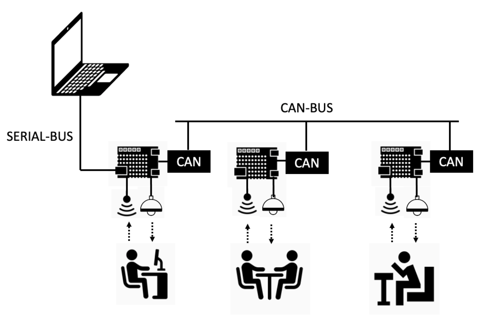

# Smart Lighting

This repository contains a networked real-time control system for a distributed illumination model of an office environment. Each desk is served by a smart luminaire mounted overhead, equipped with a light-emitting diode (LED), a light-dependent resistor (LDR) for measuring reflected light, and a presence sensor for occupancy detection. The system is implemented using Raspberry Pi Pico microcontrollers and CAN-BUS communication. Designed within a scaled, opaque cardboard box model, the project simulates coordinated dimming control to maximize user comfort and minimize energy consumption through decentralized, cooperative control algorithms.

## Authors

- [Francisco Rodrigues](https://github.com/ArmindoFlores)
- [João Marafuz Gaspar](https://github.com/joaomarafuzgaspar)

## License

This work is licensed under a [Creative Commons Attribution Non Commercial Share Alike 4.0 International][cc-by-nc-sa].

[cc-by-nc-sa]: https://creativecommons.org/licenses/by-nc-sa/4.0/legalcode